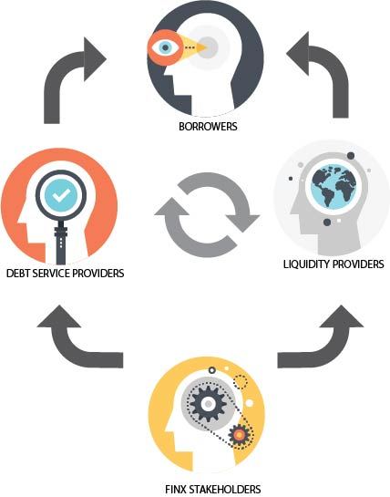

The FINX ecosystem is primarily comprised of four types of participants: Liquidity Providers, Borrowers, Credit 
Facility Service Providers and Stakeholders. Additionally, we encourage developers to expand the credit risk space with additional protocols.

In total, interactions between these classes create a positive feedback loop, fueling digital economies by defining a common language through which tokens can be pooled, traded and used.

# Liquidity Providers

Liquidity Providers supply the token working capital to the Borrowing Pool that is lent to Borrowers.

Liquidity Providers stake USDC and/or ETH tokens in the Liquidity Pool of their choice, which 
renders rewards and has characteristics that meet a particular risk profile.

Liquidity Provider rewards are accumulated continuously into the staked position, and are 
redeemed with the position when the stake is removed. Rewards are paid in the denominations and ratios 
of the particular staked pool. For pool reward characteristics and rewards, see [Credit Risk Pools](credit-risk-pools). 
The basis for the rewards is the income into the staked pool, from fees less losses.

Liquidity Providers contribute to the stability of the ecosystem by creating a market of value 
from which others can borrow.

# Borrowers

Borrowers create decentralized Loans from the Borrowing Pool that is created by Liquidity 
Providers. Borrowers thereby create a contracted debt obligation for tokens that they take from
the pool.

Borrowers must stake collateral in a collateral pool in order to retrieve tokens from the Borrowing 
pool. FINX provides the mechanism to stake tokens that represent credit provided by a counterparty.

Borrower interest is accumulated continuously. The debt obligation may be repaid according to the
repayment terms of the pool from which the loan is taken. FINX pools have maturity, floating rate and 
other features which are common amongst corporate debt financing.

When a Borrower repays the debt, the repaid tokens flow back into the Borrowing Pool and then any collateral 
may be released at the Borrower's discretion.

Borrowers contribute to the ecosystem by providing rewards to Liquidity Providers directly.

# Credit Facility Service Providers

Credit Facility Service Providers lend collateral to Borrowers by providing tokens with value 
that can be collateralized. Borrowers will pay a fraction of the face value for these credit tokens. It is 
up to the Credit Facility Service Provider to determine the credit worthiness of the Borrower, and 
the FINX ecosystem does not have a view on credit quality of individual participants in the 
decentralized network.

The FINX protocol does, however, manage the overall credit risk of the network through a Credit Risk Policy, 
a Monetary Policy, and a Credit Risk Algorithm. The systematic risk of the ecosystem is the 
responsibility of the protocol, and individuals are free to act within the protocol.

Thus Credit Facility Service Providers can take fees (rent) by providing credit tokens. The 
tokens used by the protocol are $FINXC tokens, which are a stablecoin that tracks the USDC.

Credit Facility Providers thus allow their value to be staked by Borrowers, and therefore have 
a vested interest in the stability of the system in alignment with their own interests.

# FINX Stakeholders

FINX Stakeholders purchase FINX Governance Tokens and stake them in the Safety Pool of the FINX
protocol. FINX Stakeholders earn rewards for staking their tokens and have voting rights on all
decisions affecting the protocol. Every protocol change is approved by the community of FINX 
stakeholders alone.

# Developers

Developers may develop their own analytics, user interfaces, or custom debt financing solutions 
on the FINX platform and we actively encourage the expansion of the credit market in ERC20 tokens.

To have a chat, contact us at info@finx.io

# FINX Team and Community

The FINX team along with the broader FINX community drives development of the protocol and ecosystem.
